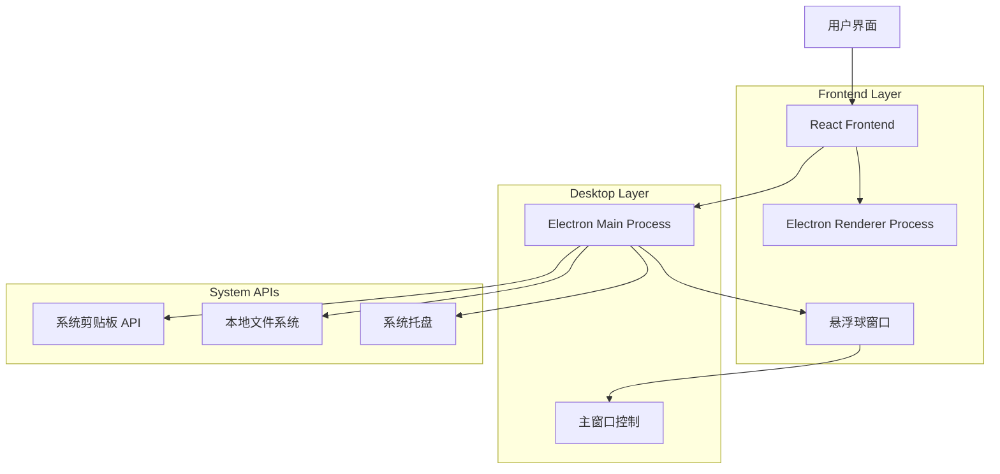
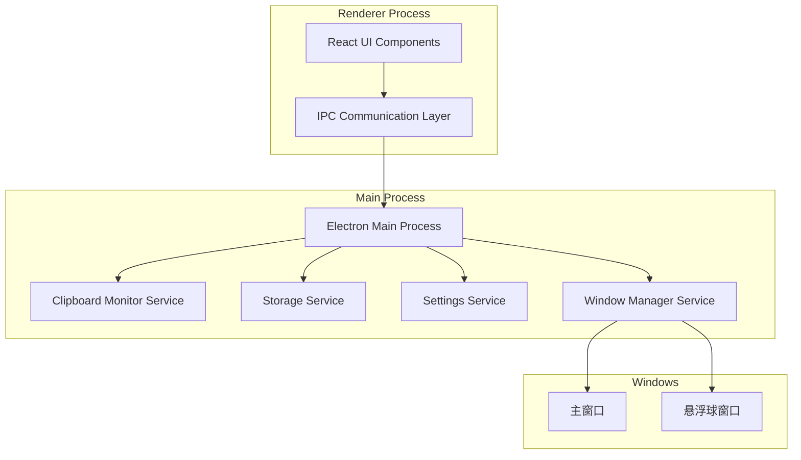
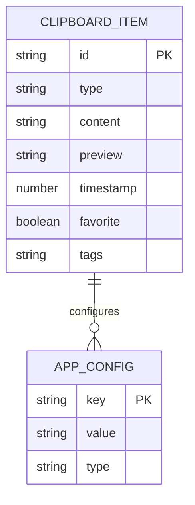

# Clipboard Viewer - 技术架构文档

## 1. Architecture design



## 2. Technology Description

- Frontend: React@18 + TypeScript@5 + Mantine@7 + Vite@5
- Desktop: Electron@28
- Window Management: electron-window-state, always-on-top
- Build Tools: electron-builder
- Development: concurrently, electron-is-dev

## 3. Route definitions

| Route | Purpose |
|-------|----------|
| / | 主界面，显示剪贴板历史列表和搜索功能 |
| /settings | 设置页面，应用配置和快捷键管理 |
| /preview/:id | 详情预览页面，查看和编辑剪贴板内容 |

## 4. API definitions

### 4.1 Core API

Electron IPC 通信接口

**获取剪贴板历史**
```typescript
ipcRenderer.invoke('clipboard:getHistory')
```

Request: 无参数

Response:
| Param Name | Param Type | Description |
|------------|------------|-------------|
| success | boolean | 操作是否成功 |
| data | ClipboardItem[] | 剪贴板历史数据 |

**监听剪贴板变化**
```typescript
ipcRenderer.on('clipboard:changed', callback)
```

**悬浮球窗口控制**
```typescript
ipcRenderer.invoke('floatingBall:toggle')
```

**主窗口显示/隐藏**
```typescript
ipcRenderer.invoke('mainWindow:show')
ipcRenderer.invoke('mainWindow:hide')
```

**设置应用配置**
```typescript
ipcRenderer.invoke('app:setConfig', config)
```

Request:
| Param Name | Param Type | isRequired | Description |
|------------|------------|------------|-------------|
| maxItems | number | false | 最大保存条目数 |
| autoStart | boolean | false | 开机自启动 |
| hotkey | string | false | 全局快捷键 |

Response:
| Param Name | Param Type | Description |
|------------|------------|-------------|
| success | boolean | 设置是否成功 |

Example:
```json
{
  "maxItems": 100,
  "autoStart": true,
  "hotkey": "CommandOrControl+Shift+V"
}
```

## 5. Server architecture diagram



## 6. Data model

### 6.1 Data model definition



### 6.2 Data Definition Language

**TypeScript 类型定义**

```typescript
// 剪贴板项目类型
interface ClipboardItem {
  id: string;
  type: 'text' | 'image' | 'file' | 'html';
  content: string;
  preview: string;
  timestamp: number;
  favorite: boolean;
  tags: string[];
  size?: number;
}

// 应用配置类型
interface AppConfig {
  maxItems: number;
  autoStart: boolean;
  hotkey: string;
  theme: 'light' | 'dark' | 'auto';
  autoCleanup: boolean;
  cleanupDays: number;
  floatingBall: {
    enabled: boolean;
    position: { x: number; y: number };
    size: number;
    opacity: number;
  };
}

// IPC 通信类型
interface IPCResponse<T = any> {
  success: boolean;
  data?: T;
  error?: string;
}
```

**本地存储结构**

```typescript
// 使用 JSON 文件存储
// ~/.clipboard-viewer/history.json
{
  "items": ClipboardItem[],
  "lastUpdated": number
}

// ~/.clipboard-viewer/config.json
{
  "config": AppConfig,
  "version": string
}
```

**项目目录结构**

```
clipboard-viewer/
├── src/
│   ├── main/                 # Electron 主进程
│   │   ├── index.ts         # 主进程入口
│   │   ├── clipboard.ts     # 剪贴板监听服务
│   │   ├── storage.ts       # 数据存储服务
│   │   ├── config.ts        # 配置管理
│   │   ├── windowManager.ts # 窗口管理服务
│   │   └── floatingBall.ts  # 悬浮球窗口控制
│   ├── renderer/            # React 渲染进程
│   │   ├── main/            # 主窗口
│   │   │   ├── src/
│   │   │   │   ├── components/  # React 组件
│   │   │   │   ├── pages/       # 页面组件
│   │   │   │   ├── hooks/       # 自定义 Hooks
│   │   │   │   ├── types/       # TypeScript 类型
│   │   │   │   ├── utils/       # 工具函数
│   │   │   │   └── App.tsx      # 应用根组件
│   │   │   ├── index.html       # HTML 模板
│   │   │   └── vite.config.ts   # Vite 配置
│   │   └── floating/        # 悬浮球窗口
│   │       ├── src/
│   │       │   ├── FloatingBall.tsx  # 悬浮球组件
│   │       │   └── index.tsx         # 悬浮球入口
│   │       ├── floating.html         # 悬浮球 HTML
│   │       └── vite.config.ts        # 悬浮球 Vite 配置
│   └── preload/             # 预加载脚本
│       └── index.ts
├── package.json
├── electron-builder.json    # 打包配置
└── tsconfig.json           # TypeScript 配置
```