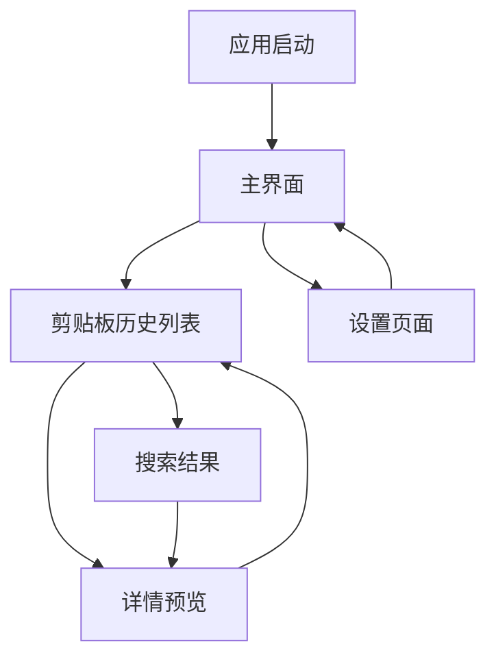

# Clipboard Viewer - 产品需求文档

## 1. Product Overview
Clipboard Viewer 是一个跨平台的桌面剪贴板管理工具，帮助用户高效管理和查看剪贴板历史记录。
- 解决用户在日常工作中频繁复制粘贴时丢失历史剪贴板内容的问题，提供便捷的剪贴板历史管理功能。
- 目标用户为需要频繁进行文本、图片复制粘贴操作的办公人员、开发者和设计师。

## 2. Core Features

### 2.1 User Roles
本产品为单用户桌面应用，无需用户注册和登录系统。

### 2.2 Feature Module
我们的剪贴板管理器包含以下主要页面：
1. **主界面**：剪贴板历史列表、搜索功能、设置入口
2. **设置页面**：应用配置、快捷键设置、存储管理
3. **详情预览**：剪贴板内容详细查看、编辑功能

### 2.3 Page Details

| Page Name | Module Name | Feature description |
|-----------|-------------|---------------------|
| 主界面 | 剪贴板历史列表 | 显示最近复制的文本、图片、文件等内容，支持时间排序和类型筛选 |
| 主界面 | 搜索功能 | 实时搜索剪贴板历史内容，支持关键词匹配和正则表达式 |
| 主界面 | 快速操作 | 双击复制到剪贴板、右键菜单删除、收藏常用内容 |
| 设置页面 | 应用配置 | 设置历史记录保存数量、自动清理规则、开机启动 |
| 设置页面 | 快捷键设置 | 自定义全局快捷键、窗口显示隐藏快捷键 |
| 设置页面 | 存储管理 | 查看存储空间使用情况、清理历史数据、导入导出设置 |
| 详情预览 | 内容查看 | 完整显示剪贴板内容，支持文本、图片、富文本格式 |
| 详情预览 | 内容编辑 | 编辑文本内容、添加标签和备注信息 |

## 3. Core Process
用户主要操作流程：
1. 启动应用后，系统开始监听剪贴板变化
2. 用户在其他应用中复制内容时，自动保存到历史记录
3. 通过快捷键或托盘图标打开主界面
4. 浏览历史记录，使用搜索功能快速定位内容
5. 双击或选择内容重新复制到剪贴板
6. 在设置页面配置应用行为和快捷键

## 4. User Interface Design
### 4.1 Design Style
- 主色调：#228be6（蓝色），辅助色：#f8f9fa（浅灰）
- 按钮样式：圆角按钮，悬停效果明显
- 字体：系统默认字体，标题 16px，正文 14px，小字 12px
- 布局风格：卡片式布局，左侧导航，顶部搜索栏
- 图标风格：使用 Tabler Icons，简洁线性图标

### 4.2 Page Design Overview

| Page Name | Module Name | UI Elements |
|-----------|-------------|-------------|
| 主界面 | 剪贴板历史列表 | 卡片式列表，每项显示内容预览、时间戳、类型图标，支持虚拟滚动 |
| 主界面 | 搜索功能 | 顶部搜索输入框，实时搜索结果高亮显示 |
| 设置页面 | 配置面板 | 分组的设置项，使用 Switch、Slider、Select 等组件 |
| 详情预览 | 内容展示 | 模态窗口或侧边栏，根据内容类型使用不同的展示组件 |

### 4.3 Responsiveness
桌面优先设计，支持窗口大小调整，最小窗口尺寸 800x600px，支持键盘快捷键操作。