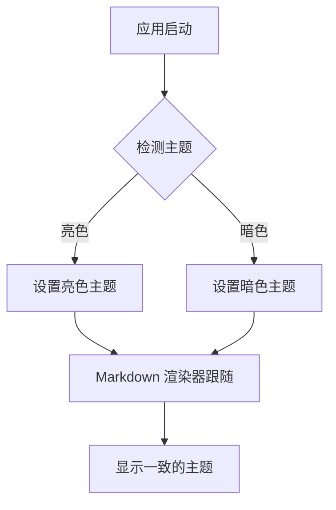

# 主题跟随测试

这是一个用于测试 markdown 渲染器主题跟随功能的文档。

## JavaScript 代码块
```javascript
function testTheme() {
  const theme = useMantineColorScheme();
  console.log('当前主题:', theme.colorScheme);
  return theme.colorScheme === 'dark' ? '暗色主题' : '亮色主题';
}

testTheme();
```

## Python 代码块
```python
def check_theme_consistency():
    """检查主题一致性"""
    print("测试主题跟随功能")
    return "主题应该与应用窗口保持一致"

check_theme_consistency()
```

## Mermaid 流程图


## 测试要点

- **代码块高亮**：应该根据应用主题显示合适的颜色
- **Mermaid 图表**：应该使用与应用主题匹配的配色方案
- **整体样式**：背景色和文字色应该与应用保持一致

> 引用块也应该正确跟随主题变化

**粗体文本** 和 *斜体文本* 在不同主题下都应该有良好的对比度。

内联代码 `useMantineColorScheme()` 也应该正确显示。

| 功能 | 状态 | 备注 |
|------|------|------|
| 代码高亮 | ✅ | 跟随应用主题 |
| Mermaid | ✅ | 动态主题切换 |
| 整体样式 | ✅ | 与应用一致 |